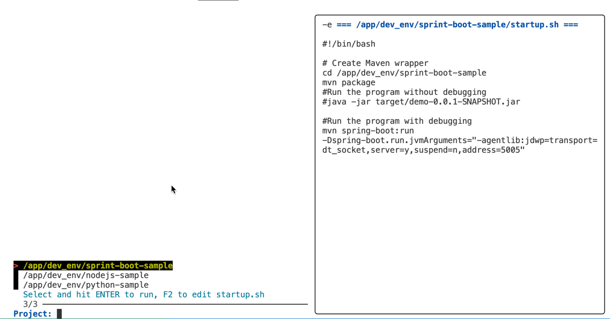

# Generic Linux Dev Box with DevContainer - Ready-to-Use Development Environment

**This project creates a generic Linux development box based on devcontainer technology, with all essential development tools and setup ready out-of-the-box. Particularly useful for Windows users who want a full Linux development environment without the complexity of WSL or dual-boot setups.**

The devcontainer provides a complete, consistent development environment that works identically across different operating systems. Simply clone, open in VS Code, and start developing with a fully configured Linux environment including zsh shell, development tools, and pre-configured settings.

## Why This Dev Box?
- **Zero Setup Hassle**: All tools pre-installed and configured
- **Perfect for Windows Users**: Get a full Linux environment instantly
- **Team Consistency**: Everyone uses the same development environment
- **Isolated Environment**: No conflicts with your host system


## 🚀 Quick Start - Get Your Linux Dev Box Running

### For Windows Users (Recommended)
This is the easiest way to get a full Linux development environment on Windows:

1. **Prerequisites** (one-time setup):
   - Install [Docker Desktop](https://www.docker.com/products/docker-desktop/)
   - Install [VS Code](https://code.visualstudio.com/)
   - Install [Remote Development](https://marketplace.visualstudio.com/items?itemName=ms-vscode-remote.vscode-remote-extensionpack) extension

2. **Get Started** (takes 2 minutes):
   ```bash
   git clone <this-repository>
   cd linux_dev_box_devcontainer
   code .
   ```
   - Click "Reopen in Container" when VS Code prompts
   - Wait for container to build (first time only)
   - **You now have a full Linux development environment!**

### What You Get Out-of-the-Box
- **Complete Linux Environment**: Ubuntu-based with zsh shell, Oh-My-Zsh, and Powerlevel10k theme
- **Built-in Project Manager**: `init_dev` command for easy project selection and initialization
- **Development Tools Ready**:
  - Git with GitHub integration
  - Java 17 + Maven
  - Node.js + npm
  - Python 3 + pip
  - Essential utilities: curl, wget, mc, fzf, fd-find
  - Database clients for PostgreSQL and MongoDB
- **VS Code Extensions**: Pre-configured with useful development extensions
- **No Host System Pollution**: Everything runs in an isolated container

### 🎯 Built-in Project Manager - `init_dev`
**One of the key features of this dev box is the built-in project initialization system:**

```bash
# Simply run this command in your terminal
init_dev
```

**What it does:**
- **Interactive Project Selection**: Browse available projects in `/app/dev_env` using fuzzy finder (fzf)
- **Smart Preview**: See each project's startup script before selecting
- **One-Click Initialization**: Hit ENTER to run the project's startup script
- **Easy Customization**: Press F2 to edit or create startup scripts for any project
- **Template Support**: Automatically creates startup scripts from templates when needed

**Perfect for:**
- Quickly switching between different development projects
- Setting up project-specific environments (databases, services, etc.)
- Onboarding new team members - they just run `init_dev` and pick their project
- Managing multiple microservices or applications in one dev environment

### For Mac/Linux Users
While this works great on Mac/Linux too, it's especially valuable for Windows users who want native Linux tooling without WSL complexity.

## 🚀 Getting Started with Your First Project

Once your dev container is running:

1. **Open a terminal** in VS Code (Ctrl+` or Cmd+`)
2. **Run the project manager**:
   ```bash
   init_dev
   ```
3. **Select a project** from the list (use arrow keys, then ENTER)
4. **Start developing** - the project environment will be automatically set up!

**Pro Tips:**
- Press **F2** while selecting to edit/create startup scripts
- Each project can have its own startup script for custom initialization
- The sample Spring Boot project is pre-configured and ready to run

# The project also includes a sample Spring Boot Hello world application downloaded from https://github.com/mkyong/spring-boot/tree/master/spring-boot-hello-world
