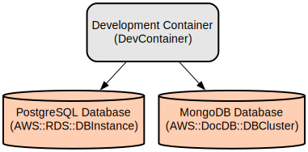

# Generic Linux Dev Box with DevContainer - Ready-to-Use Development Environment

**This project creates a generic Linux development box based on devcontainer technology, with all essential development tools and setup ready out-of-the-box. Particularly useful for Windows users who want a full Linux development environment without the complexity of WSL or dual-boot setups.**

The devcontainer provides a complete, consistent development environment that works identically across different operating systems. Simply clone, open in VS Code, and start developing with a fully configured Linux environment including zsh shell, development tools, and pre-configured settings.

## Why This Dev Box?
- **Zero Setup Hassle**: All tools pre-installed and configured
- **Perfect for Windows Users**: Get a full Linux environment instantly
- **Team Consistency**: Everyone uses the same development environment
- **Isolated Environment**: No conflicts with your host system

# The project also includes a sample Spring Boot application demonstrating user management with multi-database support, REST APIs, and various data processing capabilities.

## Repository Structure
```
.
├── dev_env/                          # Development environment configurations
│   ├── sprint-boot-sample/           # Main Spring Boot application
│   │   ├── src/                      # Source code directory
│   │   │   └── main/
│   │   │       ├── java/            # Java source files
│   │   │       │   └── com/example/demo/
│   │   │       │       ├── batch/   # Batch processing configurations
│   │   │       │       ├── camel/   # Apache Camel routes
│   │   │       │       ├── config/  # Application configurations
│   │   │       │       ├── controller/ # Web and REST controllers
│   │   │       │       ├── document/  # MongoDB document models
│   │   │       │       ├── model/   # Domain models
│   │   │       │       ├── repository/ # Data repositories
│   │   │       │       └── service/ # Business logic services
│   │   │       └── resources/      # Application resources and templates
│   │   └── pom.xml                 # Maven project configuration
├── docs/                           # Documentation files
└── .devcontainer/                  # Development container configuration
```

## 🚀 Quick Start - Get Your Linux Dev Box Running

### For Windows Users (Recommended)
This is the easiest way to get a full Linux development environment on Windows:

1. **Prerequisites** (one-time setup):
   - Install [Docker Desktop](https://www.docker.com/products/docker-desktop/)
   - Install [VS Code](https://code.visualstudio.com/)
   - Install [Remote Development](https://marketplace.visualstudio.com/items?itemName=ms-vscode-remote.vscode-remote-extensionpack) extension

2. **Get Started** (takes 2 minutes):
   ```bash
   git clone <this-repository>
   cd linux_dev_box_devcontainer
   code .
   ```
   - Click "Reopen in Container" when VS Code prompts
   - Wait for container to build (first time only)
   - **You now have a full Linux development environment!**

### What You Get Out-of-the-Box
- **Complete Linux Environment**: Ubuntu-based with zsh shell, Oh-My-Zsh, and Powerlevel10k theme
- **Built-in Project Manager**: `init_dev` command for easy project selection and initialization
- **Development Tools Ready**:
  - Git with GitHub integration
  - Java 17 + Maven
  - Node.js + npm
  - Python 3 + pip
  - Essential utilities: curl, wget, mc, fzf, fd-find
  - Database clients for PostgreSQL and MongoDB
- **VS Code Extensions**: Pre-configured with useful development extensions
- **No Host System Pollution**: Everything runs in an isolated container

### 🎯 Built-in Project Manager - `init_dev`
**One of the key features of this dev box is the built-in project initialization system:**

```bash
# Simply run this command in your terminal
init_dev
```

**What it does:**
- **Interactive Project Selection**: Browse available projects in `/app/dev_env` using fuzzy finder (fzf)
- **Smart Preview**: See each project's startup script before selecting
- **One-Click Initialization**: Hit ENTER to run the project's startup script
- **Easy Customization**: Press F2 to edit or create startup scripts for any project
- **Template Support**: Automatically creates startup scripts from templates when needed

**Perfect for:**
- Quickly switching between different development projects
- Setting up project-specific environments (databases, services, etc.)
- Onboarding new team members - they just run `init_dev` and pick their project
- Managing multiple microservices or applications in one dev environment

### For Mac/Linux Users
While this works great on Mac/Linux too, it's especially valuable for Windows users who want native Linux tooling without WSL complexity.

## 🚀 Getting Started with Your First Project

Once your dev container is running:

1. **Open a terminal** in VS Code (Ctrl+` or Cmd+`)
2. **Run the project manager**:
   ```bash
   init_dev
   ```
3. **Select a project** from the list (use arrow keys, then ENTER)
4. **Start developing** - the project environment will be automatically set up!

**Pro Tips:**
- Press **F2** while selecting to edit/create startup scripts
- Each project can have its own startup script for custom initialization
- The sample Spring Boot project is pre-configured and ready to run

## Usage Instructions
### Prerequisites
- JDK 17 or later
- Maven 3.6 or later
- PostgreSQL 13 or later
- MongoDB 4.4 or later
- Docker and Docker Compose (for development environment)

### Installation

#### Using Docker Development Environment
1. Clone the repository
2. Navigate to the project directory
3. Start the development environment:
```bash
cd .devcontainer
docker-compose up -d
```

#### Manual Installation
1. Clone the repository
2. Configure databases:
```bash
# PostgreSQL
createdb testdb
# MongoDB
mongod --auth
```

3. Build the application:
```bash
cd dev_env/sprint-boot-sample
./mvnw clean install
```

4. Run the application:
```bash
./mvnw spring-boot:run
```

### Quick Start
1. Access the application at `http://localhost:8080`
2. Login with default credentials:
   - Admin: username: `admin`, password: `admin`
   - User: username: `user`, password: `user`

### More Detailed Examples

#### REST API Usage
```bash
# Get all users
curl -X GET http://localhost:8080/users/api

# Create new user
curl -X POST http://localhost:8080/users/api \
  -H "Content-Type: application/json" \
  -d '{"name":"John Doe","email":"john@example.com"}'

# Download user data in different formats
curl -X GET http://localhost:8080/users/download/json
curl -X GET http://localhost:8080/users/download/csv
curl -X GET http://localhost:8080/users/download/xml
```

### Troubleshooting

#### Common Issues
1. Database Connection Issues
```
Error: Unable to connect to PostgreSQL
Solution: 
- Check if PostgreSQL is running: `pg_isready`
- Verify database credentials in application.properties
```

2. MongoDB Authentication
```
Error: MongoAuthenticationException
Solution:
- Verify MongoDB credentials in application.properties
- Ensure MongoDB is running with authentication enabled
```

3. Batch Import Failures
```
Error: Failed to process CSV file
Solution:
- Check CSV file format matches expected schema
- Enable debug logging: add 'logging.level.com.example.demo.batch=DEBUG' to application.properties
```

## Data Flow
The application processes user data through multiple layers, supporting both web-based and API interactions, with data storage distributed across PostgreSQL and MongoDB databases.

```ascii
[Web Browser/API Client]
         ↓
[Controllers (Web/REST)]
         ↓
[Services Layer]
         ↓
[Repositories]
    ↙         ↘
[PostgreSQL]  [MongoDB]
```

Key Component Interactions:
1. Web controllers handle user interface interactions
2. REST controllers process API requests
3. Services implement business logic and data validation
4. Repositories manage data persistence
5. Apache Camel routes handle data format conversions
6. Spring Batch processes bulk data operations
7. Security layer manages authentication and authorization

## Infrastructure



### Database Resources
- PostgreSQL Database (AWS::RDS::DBInstance)
  - Primary storage for user data and authentication
- MongoDB Database (AWS::DocDB::DBCluster)
  - Storage for document-based data and download records

### Application Resources
- Spring Boot Application (AWS::ElasticBeanstalk::Application)
  - Hosts the main application
  - Connects to both PostgreSQL and MongoDB databases